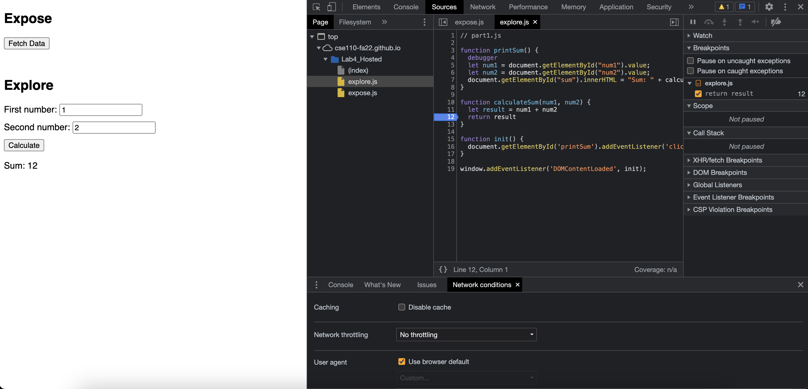
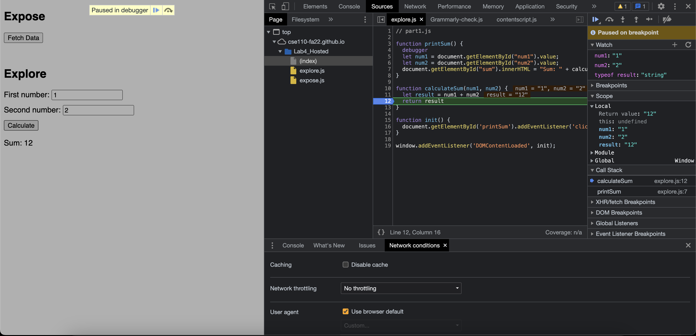
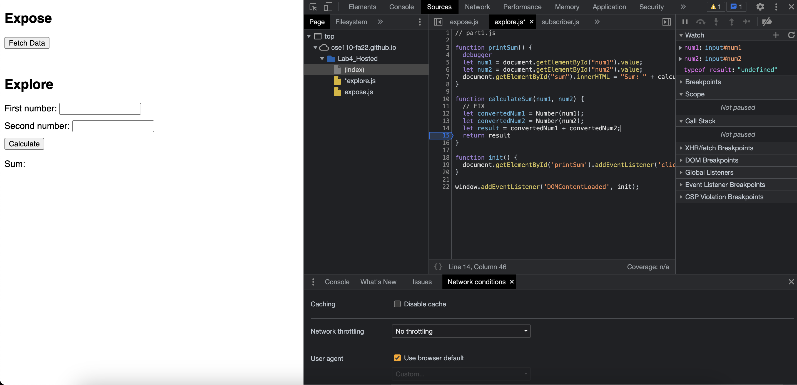

# DevTools Part 2

## Debugging Process Screenshots
Breakpoints  

Watch Expressions, Value and Data Type  

1. The bug is that the input values for num1 and num2 are strings and are not getting type converted into numbers before the summation is performed. This causes the end result to be a string that is the concatenation of the two input values which is not correct.
2. FIX

We would convert the num1 and num2 strings into numbers and then carry out the arithmetic.